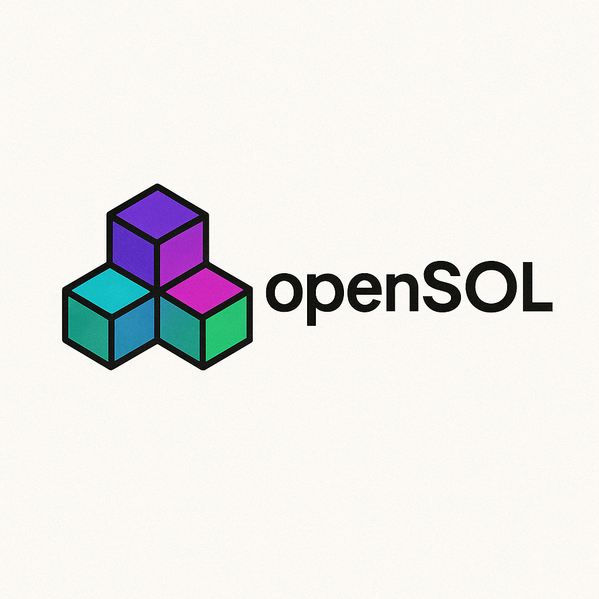

[]()
<p align="center">
  <a href="https://opensol-2.gitbook.io/opensol/">Documentation</a> |
  <a href="https://opensol.dev">Website (Not yet live)</a> |
  <a href="https://github.com/nathanliow/opensol">GitHub Repository</a>
</p>
Welcome! openSOL is a no-code platform for developers to learn, design, or create on Solana. Use blocks to create functional applications and programs that can interact with the blockchain from reading data to minting tokens. We aim to accelerate the growth of Solana's ecosystem by creating more higher quality developers and making it easier for beginners to start developing onchain.

## Overview of OpenSOL
### Why OpenSOL? ###
1. Improve education for blockchain development
2. Lack of open source code
3. Make solana/blockchain development easier with a no code solution
4. Accelerate Solana ecosystem growth

### Tech Stack ###
#### Frontend: ####
 - ReactFlow (nodes and edges)
 - NextJS 
 - Privy (authentication)
 - TypeScript

##### Backend: #####
 - @solana/web3.js (blockchain interaction)
 - Supabase (authentication + database)
 - Pinata (IPFS Provider)
 - TypeScript

### Run OpenSOL ###
OpenSOL consists of a frontend and a backend. However, (for now) only the frontend runs.

```bash
cd apps/frontend
npm install
cd ../backend
npm install
cd ../frontend
npm run dev
```

### Twitter/X: ###
[@opensoldev](https://x.com/opensoldev)

### Excalidraw: ###
[High Level Overview](https://excalidraw.com/#json=oaUn4i3wUj1kYxWnqyz9H,XtVydYB7NIJpyQzAUJTZDA)